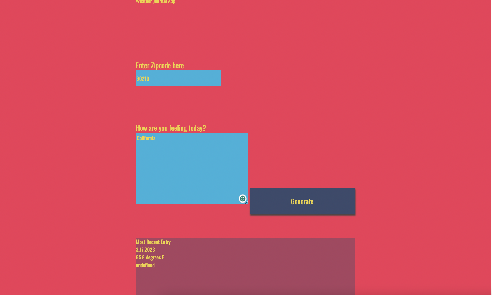
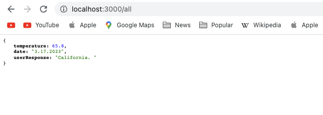
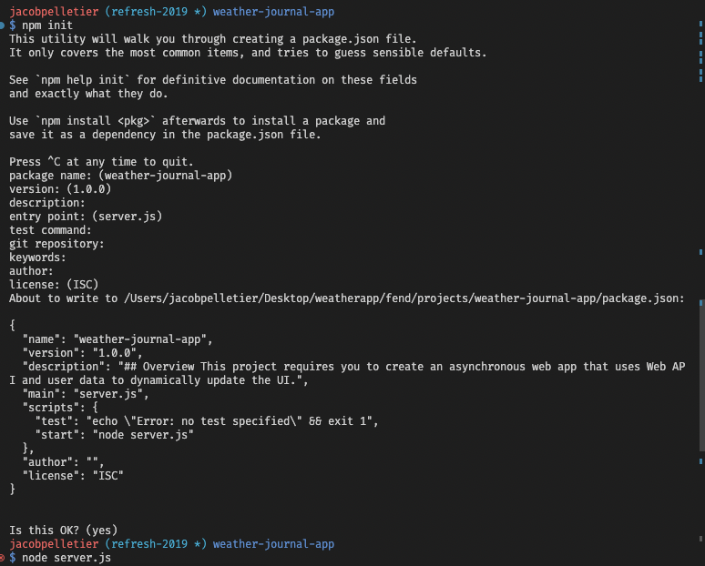

# Weather-Journal App Project

## Overview
This project requires you to create an asynchronous web app that uses Web API and user data to dynamically update the UI. 

### Example input 

### See the posted data by visiting localhost:3000/all
)

## Getting Started

### Is package.json present?

**There is a package.json**
1. Make sure there is a package.json file with the dependency of express.
2. If you do not see express installed, install it with `npm install express`.
3. Enter root directory and run `node server.js` to start server.

**There is not a package.json file**
1. Initialize a new node environment with `npm init`.
2. Install express with `npm install express`.
3. Enter root directory and run `node server.js` to start server.

**Once the project is set up**
1. Ensure the server is running
2. Visit localhost:3000
3. Enter a zip code and message
4. Submit the form.

